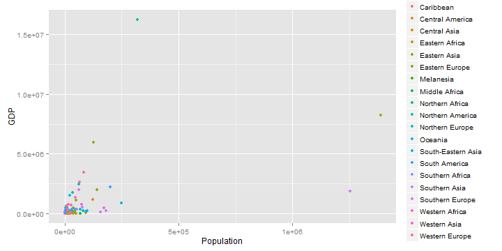
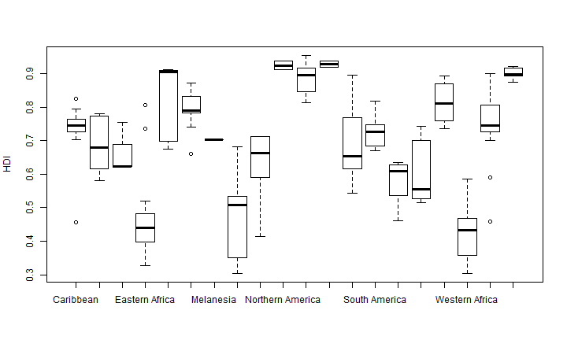

<style> 
.title-slide {background-color: #E0F8F7; /* #EDE0CF; ; #CA9F9D*/}

.title-slide hgroup > h1{font-family: 'Oswald', 'Helvetica', sanserif;}

.title-slide hgroup > h1, 
.title-slide hgroup > h2 {color: #0B6138;  /* ; #EF5150*/} </style>

## Motivation

* Initial effort to re-create visualizations presented in the Coursera Course, Configuring the World: A Critical Political Economy Approach.  The course is taught by Professor Richard T. Griffiths from Leiden University.  
* The indices chosen for this initial interactive visualization include:
    - Population
    - Gross Domestic Product (GDP) in Purchasing Power Parity (PPP)
    - GDP in current dollars
    - Human Development Index (HDI)
* The data is taken from the databases of the course and sources are explained in the About section of the app.

---

## Summary Statistics


The following is a summary of the data used in the shiny app found at [https://margarita.shinyapps.io/worldIndices/](https://margarita.shinyapps.io/worldIndices/).  As you will see, the interactive map will demonstrate some advantages over simple plots.


```r
summary(dataMap[, c('Population','HDI','GDP_PPP','GDP')])
```

```
##    Population           HDI           GDP_PPP              GDP          
##  Min.   :     54   Min.   :0.304   Min.   :     460   Min.   :     263  
##  1st Qu.:   2977   1st Qu.:0.538   1st Qu.:   20193   1st Qu.:    9951  
##  Median :   9413   Median :0.725   Median :   59838   Median :   37489  
##  Mean   :  42410   Mean   :0.680   Mean   :  555193   Mean   :  441302  
##  3rd Qu.:  28829   3rd Qu.:0.816   3rd Qu.:  360522   3rd Qu.:  248939  
##  Max.   :1385567   Max.   :0.955   Max.   :15533800   Max.   :16244600
```

--- 

## GDP and Population

GDP and Population as seen in scatter plot isn't quite as interesting as seeing the data in an interactive map view, but they have their place. Here, we can guess at the outlier countries.


```r
library(ggplot2)
qplot(Population, GDP, data = dataMap, col = Region)
```

 

```r
#plot(Population ~ HDI, data = dataMap, color='Region', type='point')
```

---

## Human Development Index

A boxplot summary of HDI by region when no maps are available. 

```r
boxplot(HDI ~ Region, data=dataMap, ylab="HDI")
```

 

